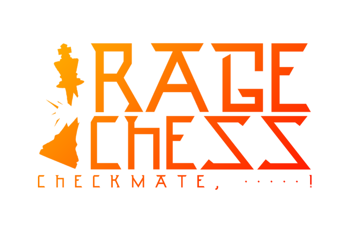

Last Friday, my team and I presented and demonstrated Rage Chess.

Watch our Demo Day presentation [here](https://www.youtube.com/watch?v=vbvFjBUNubo) (we start ~1:32:00):

<iframe  width="100%"  height="400px"  src="https://www.youtube.com/embed/vbvFjBUNubo?t=5519"  title="YouTube video player"  frameborder="0"  allow="accelerometer; autoplay; clipboard-write; encrypted-media; gyroscope; picture-in-picture"  allowfullscreen></iframe>

Watch our game trailer here:

<iframe  width="100%"  height="400px"  src="https://www.youtube.com/embed/CHwq2JNkkTU"  title="YouTube video player"  frameborder="0"  allow="accelerometer; autoplay; clipboard-write; encrypted-media; gyroscope; picture-in-picture"  allowfullscreen></iframe>

 

# The Project

As Holberton students at the end of our foundational curriculum, we were tasked with planning, building, and presenting a product that utilized all of the skills and knowledge we have gained over the last 9 months of school. As we will be specializing in AR/VR here at Holberton, we wanted to see how much we could learn and accomplish on our own, before we start that curriculum, that way we could continue to improve this project as we learn more about Unity and C# throughout the curriculum. We are immensely proud of how much we have learned and accomplished already and we are more than excited to continue improving Rage Chess beyond it's demo day release.

The idea for the game was sparked from discussing development of a normal chess game in VR, but quickly grew beyond that as ideas spewed into our #vrchess slack channel. Throwing pieces, flipping the board, breaking the table, we conjured up an endless number of ways to add chaos and destruction into chess, the only thing we did not know was how we would actually go about creating them. We dove into documentation and tutorials both for basic work in Unity as well as specifically for use of the XR interaction toolkit and Photon Pun 2. After our allotted work time of two weeks we were very proud of the state of our game and how many features we managed to implement in-time. We halted feature development and began fixing all major issues and cleaning up the project for a demo-day ready release, available [here](https://github.com/aydentownsley/RageChess).

Working on this project was very satisfying for me personally, as I have always wanted to seriously tackle a project inside of a game engine, but I have never had the spare-time to put in the work necessary. I have had a lifetime love for video-games and that continued with VR games when I purchased my Oculus CV1 over 5 years ago. It has contributed greatly to both my mental and physical health even in it's early form and I want to be part of pushing it to its limits. Now, with my Quest 2, the technology has come even further and so have the tools to build the experiences for them!

The game is made up of quite a lot of components, and we each had a role in all of them:

## Unity:

The game is built inside of Unity 2020 using the latest version of the XR interaction toolkit package, this was used for using the VR devices inside the unity scene and enabling basic interactions with other scene objects.

## XR Rig:

The XR rig is loaded into every scene and maps to the headset on the player's head, and the controllers to their hands. It also allows for customizable interactions with other scene objects and User Interface elements like clickable-buttons. Attached above the shoulder (currently limited to right, but planned for customizability) is a quiver where the player can pull arrows from to load the bow. The base functionality of this is provided by VR with Andrew on youtube, and this same project was used in Unity's own prototype showcase video.

## Start Screen:

The start screen is a fairly simple scene, but it's important because it acts as a gateway between the player and the play room with other players. We currently only have a set of instructions and a button, that replaces itself with another button that joins the room of the game. We hope to add customizable settings such as right and left handedness, a server browser with multiple rooms to join, a spectate option, and more.

## Photon Pun 2:

This service is an amazing package for unity that provides well-documented and powerful networking tools for Unity games/projects. We have only scratched the surface and of its capabilities, including having just recently added Voice chat a mere four days after our Demo-Day. It allows you to host Unity scenes online that multiple players can be loaded into. Using it we can transfer players from their start screens into different scenes, currently only our one gameroom. We can then use photon to transfer interactions local interactions to network interactions allowing all players to see the same thing.

## The Gameroom:

This is the scene players are loaded into after leaving the startscreen. In here we have an interactable chess set and board, buttons to save and reset their positions, as well as an array of weapons to interact with said board and set with. In here you can cause full mayhem in your chess match and reset it at will. We aim to add a plethora of interactions and weapons, new environments, custom prefabs, and more.

The whole process for creating this project was enjoyable. Even bugs and major issues could be entertaining when I'm immersed inside of a virtual world with my teammates and these bugs and issues appear as hilarious interactions or behavior of gameobjects or the other player.

Having no experience with C# definitely lead to many issues in this project, but I feel like I have learned so much of it from just examining the XR toolkit's code and reading it's and Photon Pun's documentation as well as tutorials for scripting for unity and I can not wait to learn to reapply right back into this project.

## Project Links:
[Github Repository](https://github.com/aydentownsley/RageChess), [Landing Page](https://aydentownsley.github.io/RageChess/)

## Team Roles:

 - Valerie Nierenberg: **Deployment & Docs** - [Github](https://github.com/valerienierenberg) - [@Val_Gal_Pal_](https://twitter.com/Val_Gal_Pal_) - valerie.nierenberg@gmail.com
 - Kyle Whitten: **Asset Integration** - [Github](https://github.com/kwhit2) - [@kwhit212](https://twitter.com/kwhit212) - gigawhitt@gmail.com
 - Peyton Smith: **XR Toolkit** - [Github](https://github.com/peytonbrsmith) - [@peytons0606](https://twitter.com/peytons0606) - peyton.smith@holbertonschool.com
 - Ayden Townsley: **Networking** - [Github](https://github.com/aydentownsley) - [@whoziwhatzit_](https://twitter.com/whoziwhatzit_) - aydentownsley@gmail.com

 

*It is worth noting that these roles are more about who felt most comfortable discussing the cited area. This team worked together on all aspects of Rage Chess*
