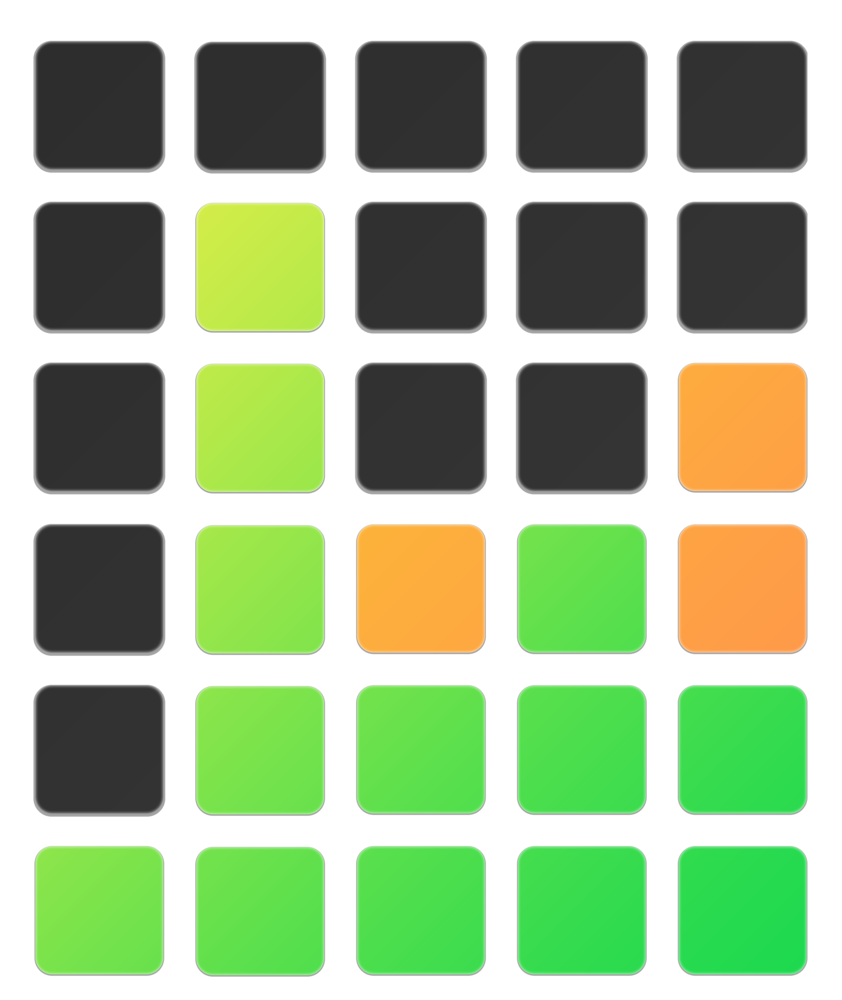

---

  
  <b> Get it on the <a href="https://www.microsoft.com/en-us/p/windle/9nw9pr0lcpc9">Microsoft Store</a>! </b>

---

## Features
* Play your favorite word game right on your windows desktop! 🪟
* Track your game history! 📘
* Share your results! ✉️
* Change between a Dark or Light theme! ☀️/🌙

---

## Screenshots

 

 

---

## Latest Updates:

  #### 1.0.2 UPDATE

  * Improved Dictionary 📖
  * Added Missing 6th Row (how did I not notice this???) 🚣
  * Added Shareable Winning Results String 🏆
  * Minor adjustments ⚙️

  #### In the works:

  * Daily Word that matches Wordle™️online
  * Improved Game History
  * Game settings
  * Daily/Random
  * Word Length
  * variable rows/columns

---

Review my <a href="privacy/">Privacy Policy</a> 

