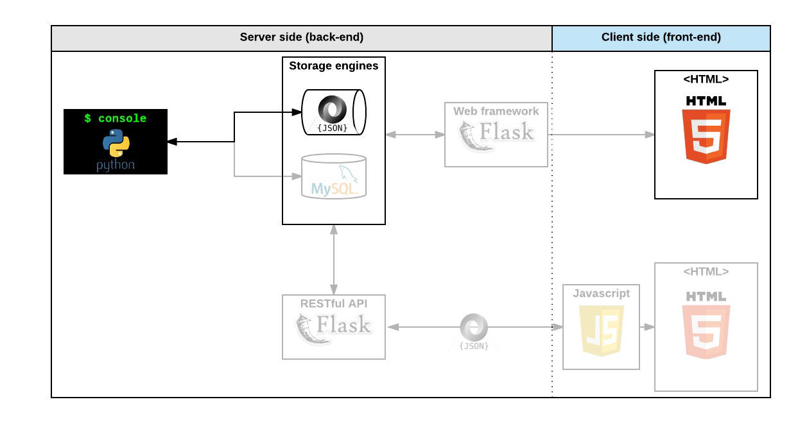

Project Links: [v0.0](https://github.com/peytonbrsmith/airbnb_clone) [v0.5](https://github.com/peytonbrsmith/airbnb_clone_v2) [v0.75](https://github.com/peytonbrsmith/airbnb_clone_v3) [Final](https://github.com/peytonbrsmith/airbnb_clone_v4)

This was an iterative and collaborative project which spanned multiple repositories and contributors.

The goal of the project was to deploy a recreation of the [AirBnB website](https://www.airbnb.com/ "AirBnB website").

-   A command interpreter to manipulate data without a visual interface,
    like in a Shell (perfect for development and debugging)
-   A website (the front-end) that shows the final product to everybody:
    static and dynamic
-   A database or files that store data (data = objects)
-   An API that provides a communication interface between the front-end
    and your data (retrieve, create, delete, update them)

## Final product

### The console

-   create your data model
-   manage (create, update, destroy, etc) objects via a console /
    command interpreter
-   store and persist objects to a file (JSON file)

### Web static

-   learn HTML/CSS
-   create the HTML of your application
-   create template of each object

### MySQL storage

-   replace the file storage by a Database storage
-   map your models to a table in database by using an O.R.M.

### Web framework - templating

-   create your first web server in Python
-   make your static HTML file dynamic by using objects stored in a file
    or database

### RESTful API

-   expose all your objects stored via a JSON web interface
-   manipulate your objects via a RESTful API

### Web dynamic

-   learn JQuery
-   load objects from the client side by using your own RESTful API

## Data diagram

